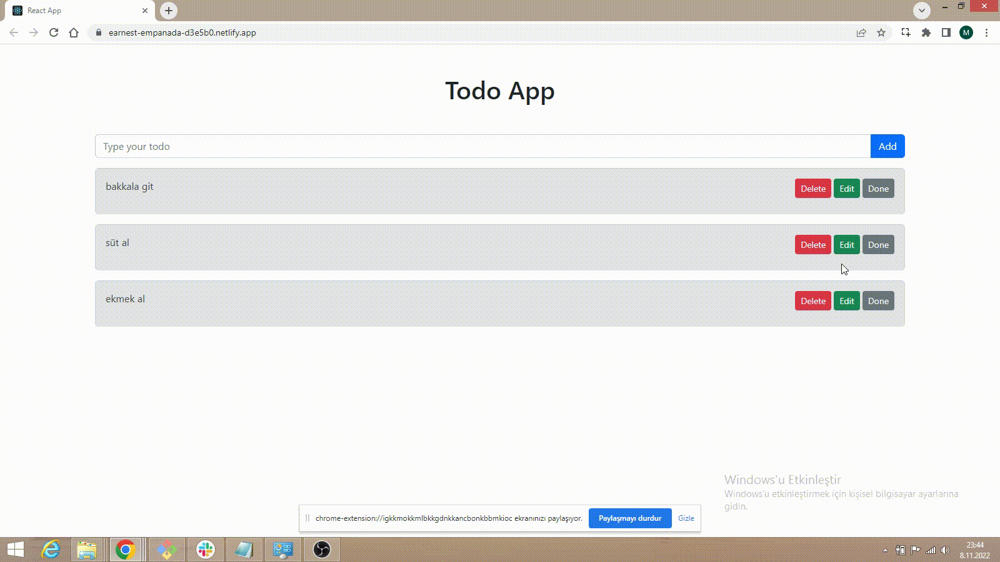

<h1>TODO APP with REACT</h1>

Bu proje React kullanılarak TODO APP yapımını göstermektedir. Aynı zamanda site netlify üzerinden yayınlanmış olup kısa vadeli kullanıma sunulmuştur.
Projede react companent kullanımları, funcion based methodu ve diğer başlangıç düzeyi react özellikleri mevcuttur.

<h2> HARİCİ DURUMLAR </h2>

TODO APP

<a href="https://earnest-empanada-d3e5b0.netlify.app/"> Site Linki</a>

<h3> SİTE GÖRÜNÜMÜ </h3>

<h3> GÖRÜNTÜ </h3>

